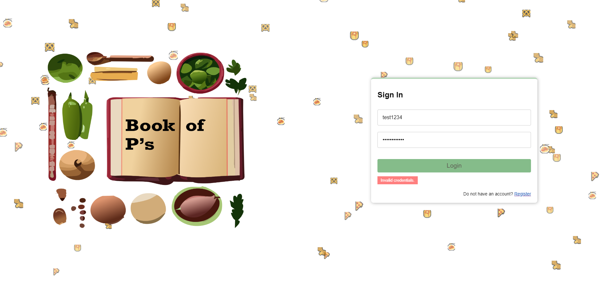

# Book of P's

  

    Digital Recipe Repository Built on a Custom Hypertext Framework
     
    <a href="https://youtu.be/06mUj7hBhy0"><strong>View Demo »</strong></a>
     
     
  

 

The Book of Ps (i.e. Recipes) is a collaborative hypertext framework-based recipe repository. The site supports user login, authentication, and persistent user data storage via MongoDB. Users use our hypertext nodes to store recipes, create links to other nodes, and share their nodes with others (a la style of Google Docs). The key feature of the Book of Ps is the persistence of links between text, images, and nodes themselves across the whole system and user space. The website is deployed via Vercel and built with React, Typescript, and MongoDB.

## Features

- 🔒 **Secure Authentication**: User login and account management with proper authentication and authorization  
- 📖 **Recipe Management**: Create, edit, and delete personal recipes  
- 🔗 **Flexible Linking**: Link related recipes together for easier navigation  
- 🔍 **Search Functionality**: Quickly find recipes through dynamic queries  
- 🤝 **Sharing**: Share recipes with other users in the app  
- 🎨 **User Interface**: Responsive, aesthetic UI designed with React for a smooth user experience  

## Tech Stack

- **Frontend**: React, CSS  
- **Backend**: Node.js, Express.js  
- **Database**: MongoDB  
- **Other**: Authentication middleware, RESTful APIs  

## Project Status

⚠️ **Archived** — This project was developed between **November and December 2023** as a personal project.  
It is not actively maintained, but the code remains available as a portfolio showcase.  
